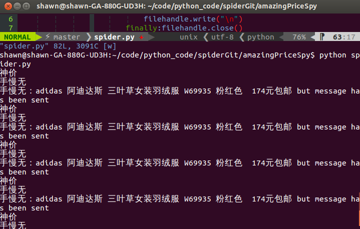

##amazingPriceSpy
===============
This package contains '__spider.py__' and '__sendemail.py__'

It can be used to listen the www.smzdm.com or www.rehui.com each 20 second, :ewWhen the amazing price come up, the masseage will send to your 139mail. Then, you will get the link and contant by phone message from 139mail. In this way, you can get the imformation at first time.

before you use it you need to change sth __sendemail.py__, replace it by your own mail configure.

__mailto_list__, __mail_host__, __mail_pass__,__mail_postfix__
>mail_host="smtp.163.com"
mail_user="username"
mail_pass="pwd"
mail_postfix="163.com"

You will  also need to change sth in __spider.py__,replace it with your phone mail.
>mailto_list=["18359xxxx05@139.com"]

###Usage:
>python spider.py

enjoy it.
